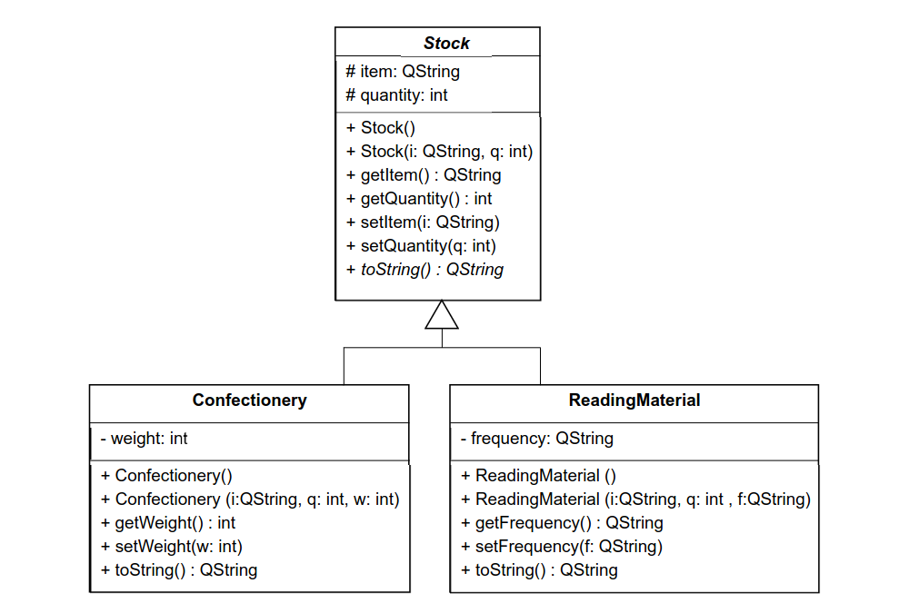
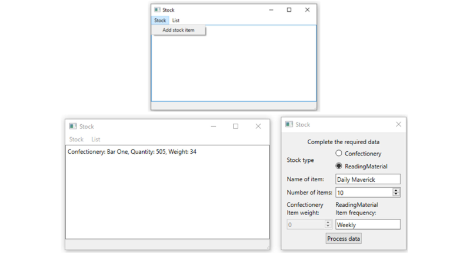
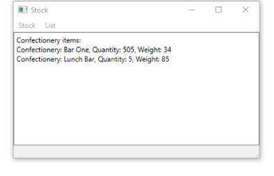

# COS711 Assignment 2 - Question 2

Write a GUI application that implements the classes that will be used to keep stock for a small
corner store that sells only confectionery and reading material. 

For each item you will track two
things: what it is, and how many items you have in stock. The derived classes will add one
appropriate data member of their own.

Use the UML class diagram below to assist you. Note that
you should not be able to instantiate the Stock class; that is, you should not be able to create an
object/instance of the Stock class




When a user chooses to add an item from the menu, use the Factory Method design pattern to
return a pointer to either a Confectionary or ReadingMaterial object from the data entered
by the user.

The factory method should take a QString as an argument indicating what type of
item is required, as well as the data used to construct the specific object. Note that the factory
method should have only one createStock() function; however, the objects that it has to
create, although they both have three arguments, are made up of different data types. Solve this
problem in the simplest possible way.

You should then be able to do something similar to the following, although this is not entirely
correct as the two signatures of the createStock() function differ – they should be the same.
```
MyStockFactory sf;
Stock* c1 = sf.createStock("Confectionary", "Kit Kat", 12, 65);
Stock* rm1 = sf.createStock("ReadingMaterial", "The Star", 100,"Daily");
```

When items are created, display these objects’ data on the GUI.




Implement a stock list based on a Singleton design pattern. 

The only instance of the stock list
should have two lists: one for confectionery, and one for reading material. There should only be
one addStock() function (which would need to check what is being added so that it knows which
list to add the item to – achieve this using QMetaObject).


The user must be able to select which list (confectionery or reading material) to display on the
GUI, and all items of that particular type held in the list should be displayed. This should be
implemented via a single function in the list

